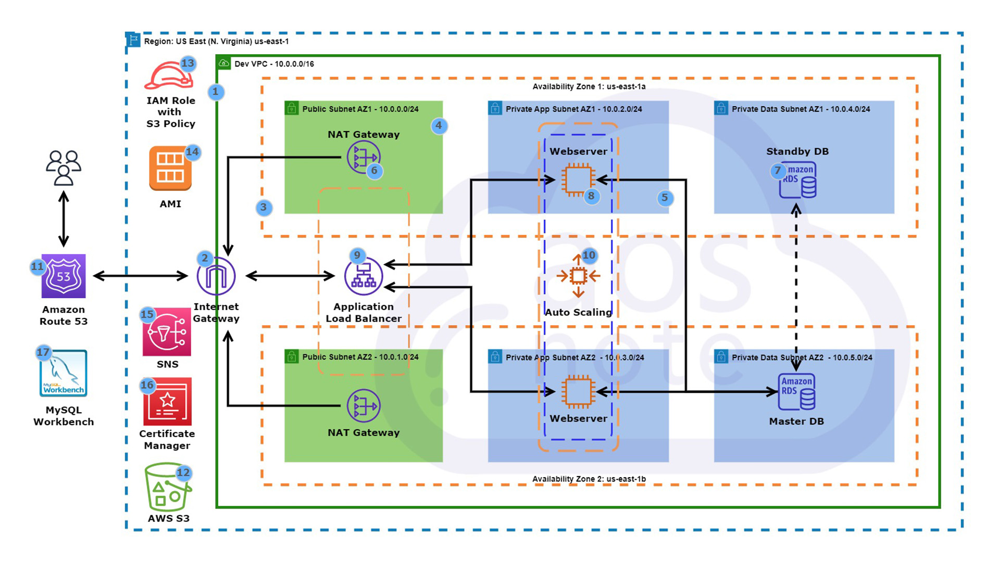

Hosting a Dynamic Web Application on AWS
Welcome to our AWS deployment guide for hosting a dynamic web application. This project provides a robust architecture that ensures high availability, scalability, and security for your dynamic web applications.

Architecture Overview
Refer to the architecture diagram provided in this repository for a visual guide. The AWS infrastructure setup includes:

VPC: A Virtual Private Cloud to host all the resources with public and private subnets across two Availability Zones (AZs) for fault tolerance.
Internet Gateway: To allow internet connectivity to the VPC.
NAT Gateway: Placed in the public subnet to allow instances in the private subnet to access the internet securely.
Application Load Balancer (ALB): Distributes incoming traffic across multiple targets in the Auto Scaling Group.
Auto Scaling: Automatically adjusts the number of instances during traffic spikes to maintain steady, predictable performance.
EC2 Instances: Web servers running within private subnets in different AZs to host the web application.
Amazon RDS: Master and standby databases in different AZs for data redundancy and high availability.
S3 Bucket: To store and retrieve any amount of data at any time.
IAM Role with S3 Policy: To securely control access to AWS services and resources for the EC2 instances.
Amazon Route 53: For DNS and traffic management.
AWS Certificate Manager: For managing SSL/TLS certificates.
Simple Notification Service (SNS): For notifications and automating the publishing of messages.
AMI: Amazon Machine Images to quickly launch EC2 instances that are pre-configured.
MySQL Workbench: For database management.
Deployment Steps
The following steps are a high-level guide to deploying a dynamic web application:

1. AWS Setup
Set up your VPC with subnets, internet gateway, NAT gateways, and route tables as depicted in the architecture diagram.
Define your Security Groups for ALB, EC2 instances, and RDS.
Create an IAM role with S3 full access to be attached to EC2 instances.
2. Database Setup
Launch an RDS instance in your private subnets, with a master in one AZ and a standby replica in another AZ for high availability.
Configure your security groups to allow access from your EC2 instances.
3. Application Deployment
Launch an EC2 instance using the AMI with your web application's environment pre-configured.
If your application requires, attach an EFS for shared storage between instances.
Configure the application to connect to the RDS database instance.
Store static assets in the S3 bucket and set up proper bucket policies.
4. Load Balancer and Scaling
Set up an Application Load Balancer in public subnets, directing traffic to the EC2 instances in private subnets.
Create an Auto Scaling Group and define scaling policies based on the traffic.
5. Domain, SSL, and SNS
Register a domain with Route 53 and configure the DNS settings.
Use AWS Certificate Manager to create and manage an SSL certificate for your domain.
Set up SNS topics to send notifications regarding scaling activities and other notifications as needed.
6. Continuous Monitoring and Management
Implement Amazon CloudWatch for monitoring the performance of your EC2 instances, RDS databases, and other AWS services.
Use AWS CloudTrail for governance, compliance, operational auditing, and risk auditing of your AWS account.
Contributing
If you would like to contribute to this project or have suggestions, please fork the repository and create a pull request with your updates.
